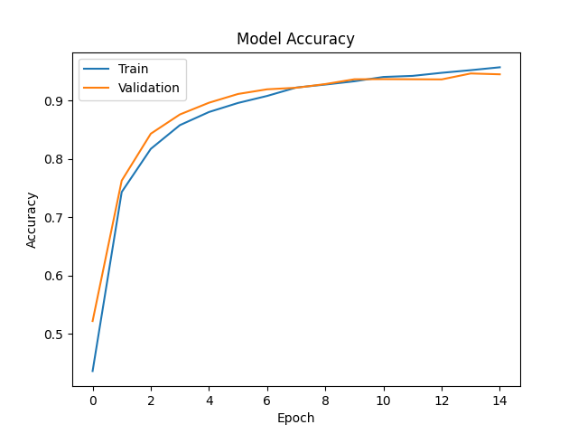
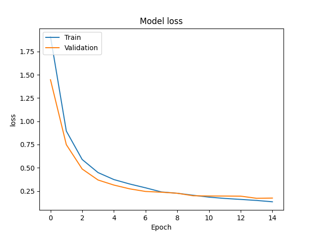
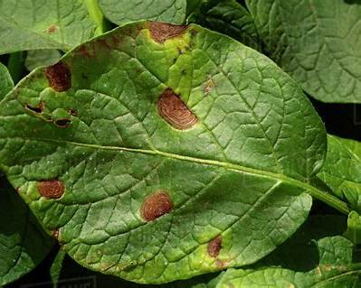
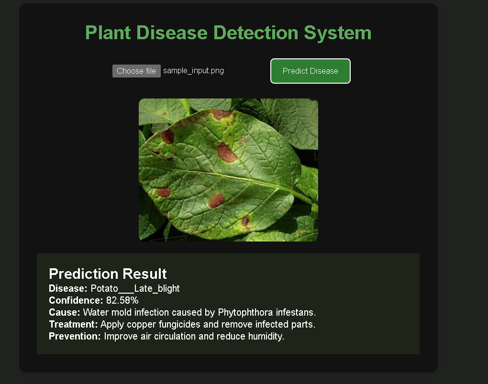

# 🌿 AI-Powered Plant Disease Detection System

## 🌐 Live Demo

[Live Demo](https://cnn-plant-disease-detection-system-9.onrender.com/)

An end-to-end Deep Learning and Computer Vision web application that detects plant diseases from leaf images using Transfer Learning with MobileNetV2.

The system now includes a **binary leaf vs non-leaf classifier** to improve robustness and reject invalid images before disease prediction.

The application provides:

* Disease prediction
* Confidence score
* Cause of disease
* Treatment recommendations
* Prevention methods
* Invalid image rejection for non-plant images

---

# 🚀 Features

✅ Deep Learning-based plant disease classification
✅ Binary Leaf vs Non-Leaf validation model
✅ Transfer Learning using MobileNetV2
✅ Fine-Tuned CNN architecture
✅ FastAPI backend for inference
✅ Interactive frontend for image upload
✅ Recommendation system for treatment & prevention
✅ Real-time image prediction
✅ Invalid image rejection system
✅ Deployment-ready architecture
✅ Production-style multi-stage inference pipeline

---

# 🧠 Updated Model Architecture

## Stage 1 — Binary Classification

The uploaded image is first passed through a lightweight CNN classifier:

```text
Leaf vs Non-Leaf
```

This prevents invalid predictions for:

* Random images
* Cartoons
* Screenshots
* Non-plant objects

---

## Stage 2 — Disease Classification

If the image is classified as a valid leaf image:

```text
Leaf Image
    ↓
Disease Classifier
    ↓
Disease Prediction
```

The disease classifier uses:

* MobileNetV2 (ImageNet pretrained)
* Transfer Learning
* Fine-Tuning

---

# 🏗️ Inference Pipeline

```text
User Uploads Image
          ↓
Leaf vs Non-Leaf Classifier
          ↓
If Valid Leaf:
    Disease Classification
Else:
    Reject Invalid Image
          ↓
Disease Prediction
          ↓
Treatment & Prevention Recommendation
          ↓
Frontend Displays Results
```

---

# 📊 Model Performance

| Metric                     | Value          |
| -------------------------- | -------------- |
| Training Accuracy          | ~95%           |
| Validation Accuracy        | ~96%           |
| Validation Loss            | ~0.11          |
| Classes                    | 15             |
| Dataset Size               | 20,000+ Images |
| Binary Classifier Accuracy | ~80%+          |
| Architecture               | MobileNetV2    |

---

# 📈 Accuracy Graph



---

# 📉 Loss Graph



---

# 🖼️ Sample Input Image



---

# ✅ Sample Prediction Output



---

# 🧪 Supported Plant Diseases

## Pepper

* Pepper__bell___Bacterial_spot
* Pepper__bell___healthy

## Potato

* Potato___Early_blight
* Potato___Late_blight
* Potato___healthy

## Tomato

* Tomato_Bacterial_spot
* Tomato_Early_blight
* Tomato_Late_blight
* Tomato_Leaf_Mold
* Tomato_Septoria_leaf_spot
* Tomato_Spider_mites_Two_spotted_spider_mite
* Tomato__Target_Spot
* Tomato__Tomato_YellowLeaf__Curl_Virus
* Tomato__Tomato_mosaic_virus
* Tomato_healthy

---

# 🏗️ Tech Stack

## Machine Learning & Deep Learning

* TensorFlow
* Keras
* MobileNetV2
* NumPy
* OpenCV
* Pillow

## Backend

* FastAPI
* Uvicorn
* Python

## Frontend

* HTML
* CSS
* JavaScript

## Deployment

* Render

---

# 📂 Updated Project Structure

```text
CNN-PLANT-DISEASE-DETECTION-SYSTEM/
│
├── backend/
│   ├── __init__.py
│   ├── class_names.json
│   ├── finetuned_plant_disease_detection_model.keras
│   ├── plant_nonplant_classifier.keras
│   ├── main.py
│   ├── predict.py
│   ├── recommendations.py
│   └── testpredict.py
│
├── frontend/
│   ├── static/
│   │   ├── script.js
│   │   └── style.css
│   │
│   └── templates/
│       └── index.html
│
├── images/
│   ├── accuracy_plot.png
│   ├── loss_plot.png
│   ├── sample_input.png
│   └── sample_output.png
│
├── dataset/
├── plant_vs_nonplant_dataset/
├── binaryclassifiertrain.py
├── finetuned_model_train.py
├── train.py
├── requirements.txt
├── readme.md
└── .python-version
```

---

# ⚙️ Installation

## Clone Repository

```bash
git clone <your-github-repo-link>
cd CNN-PLANT-DISEASE-DETECTION-SYSTEM
```

---

# 📦 Create Virtual Environment

```bash
python -m venv .venv
```

---

# ▶️ Activate Environment

## Windows

```bash
.venv\Scripts\activate
```

## Linux / Mac

```bash
source .venv/bin/activate
```

---

# 📥 Install Dependencies

```bash
pip install -r requirements.txt
```

---

# 🚀 Run Application

```bash
uvicorn backend.main:app --reload
```

Application runs on:

```text
http://127.0.0.1:8000
```

---

# ☁️ Deployment

The application is deployed on Render:

[Deployed Application](https://cnn-plant-disease-detection-system-9.onrender.com/?utm_source=chatgpt.com)

---

# 🧠 Machine Learning Concepts Used

* Transfer Learning
* Fine-Tuning
* Binary Classification
* Multi-Class Classification
* Data Augmentation
* Early Stopping
* Confidence Thresholding
* Multi-Stage Inference Pipelines
* Real-World Input Validation

---

# 📌 Future Improvements

* YOLO-based leaf detection
* Disease segmentation
* TensorFlow Lite optimization
* Real-time camera prediction
* Mobile application deployment
* Explainable AI (Grad-CAM)
* Multi-language support
* Cloud database integration

---

# 👨‍💻 Developer

Sai Abhishek

Second-Year Engineering Student passionate about:

* Artificial Intelligence
* Machine Learning
* Deep Learning
* Computer Vision
* AI Deployment

---

# ⭐ If You Like This Project

Give this repository a star on GitHub.
